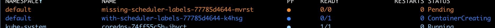

# 🐰 Rabbit Scheduler 🐰

This is an example of how to write a simple filter for Kuberentes the scheduler plugin system.
When the plugin is installed and examples run, only one will schedule successfully.

## Installation

- `kubectl apply -f deploy`

After the scheduler plugin has been insalled

- `kubectl apply -f examples`

This is an example of how to write a simple filter for Kubernetes the scheduler plugin system.

## Prior art

- https://kubernetes.io/docs/tasks/extend-kubernetes/configure-multiple-schedulers/
- https://github.com/kubernetes-sigs/scheduler-plugins
- https://kubernetes.io/docs/concepts/scheduling-eviction/kube-scheduler/
- https://kubernetes.io/blog/2020/12/21/writing-crl-scheduler/
- https://github.com/cockroachlabs/crl-scheduler
- https://github.com/kubernetes-sigs/scheduler-plugins/blob/master/doc/install.md

